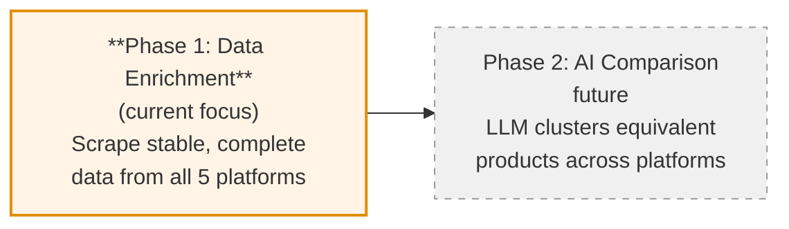
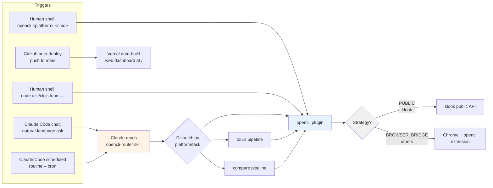
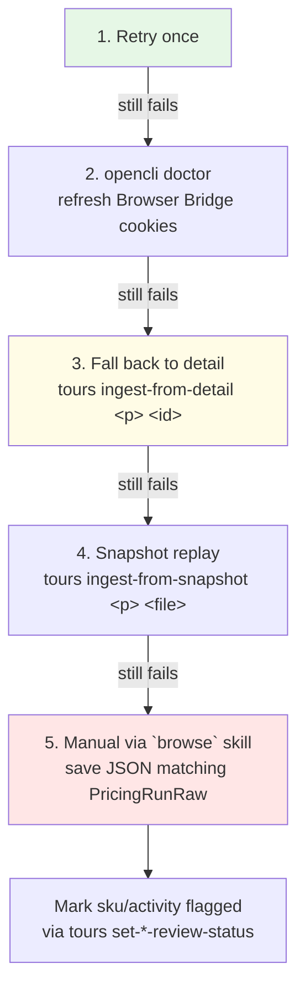
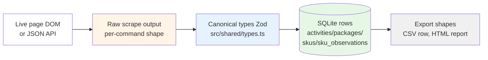
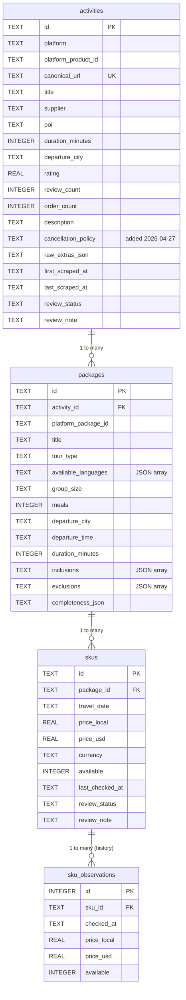
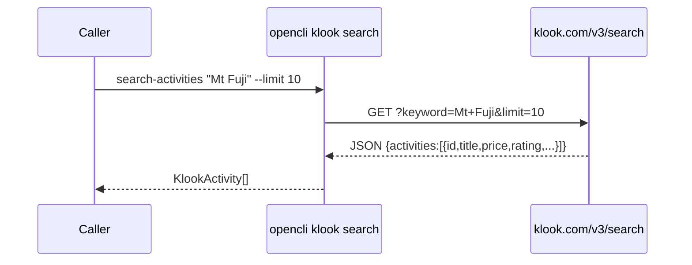
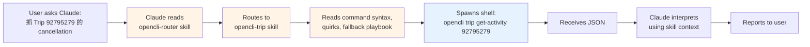

# Project Overview — Travel Competitor Monitor

> **Audience**: someone (human or agent) joining the project who needs the full mental model in one place.
> **Last refreshed**: 2026-04-27

This doc is the map. For platform-specific quirks read each `opencli-<platform>` skill. For DB column-by-column field mapping read [`io-schemas.md`](./io-schemas.md). For BD ↔ core-team handoff read [`colleague-handoff.md`](./colleague-handoff.md).

---

## 1. What this project does

Cross-platform price-and-content monitor for travel activities (day tours, attractions, experiences) across **5 OTA platforms**:

| Platform | Domain | Strategy | ID format |
|---|---|---|---|
| Klook | klook.com | Public API (`PUBLIC`) | numeric, e.g. `151477` |
| Trip.com | trip.com | Browser Bridge (`COOKIE`) | numeric, e.g. `92795279` |
| GetYourGuide | getyourguide.com | Browser Bridge | numeric trailing `-t<id>`, e.g. `1035544` |
| KKday | kkday.com | Browser Bridge | numeric, e.g. `2247` |
| Airbnb Experiences | airbnb.com | Browser Bridge | numeric, e.g. `121104` |

Output of the pipeline is a **planning CSV + HTML report** for the BD team showing comparable activities and per-day pricing across the 5 platforms.

### 1.1 Project phases — we are in **Data Enrichment**



**Phase 1 — Data Enrichment (current)**
The goal is *stable, complete, trustworthy* per-platform scraping. Every field we declare in `KlookDetail` should populate consistently across products on each platform; missing fields should be platform-specific quirks that we *understand and document*, not "the scraper failed silently". This phase is what the rest of this doc describes.

**Phase 2 — AI Comparison (future)**
Once enrichment is reliable, an LLM step clusters "the same product sold on different OTAs" and emits a comparison view. Code skeleton exists under `src/compare/`, but it's out of the current scope and should not be invoked in production routines until enrichment completeness reaches a stable bar.

Concretely, the bar to exit Phase 1 is roughly:
- All 5 platforms scrape title / rating / review_count / supplier / cancellation_policy / a 7-day pricing matrix on ≥95% of attempted product pages
- Per-platform completeness report (`tours generate-report`) shows no field consistently missing on a given platform without an explanation in that platform's skill
- Tours DB has weeks of `sku_observations` history, so we can detect price anomalies before the LLM sees the data

---

## 2. Three execution layers (from primitives upward)

```
       ┌─────────────────────────────────────────────────┐
       │  Claude Code skills (orchestration only)         │
       │  opencli-router, opencli-<platform>,             │
       │  opencli-tours-routine, opencli-compare-poi      │
       └────────────────────┬────────────────────────────┘
                            │ invokes (deterministic)
                            ▼
       ┌─────────────────────────────────────────────────┐
       │  Tours / Compare modules (TS)                    │
       │  src/tours/ — ingest, normalize, db, export      │
       │  src/compare/ — search-fanout, LLM cluster       │
       └────────────────────┬────────────────────────────┘
                            │ shells out to
                            ▼
       ┌─────────────────────────────────────────────────┐
       │  opencli plugins (5 platform adapters)           │
       │  src/clis/<platform>/ → search, detail, pricing  │
       │  Compiled to dist/, symlinked into ~/.opencli    │
       └─────────────────────────────────────────────────┘
```

**Important**: skills are *advisory only*. The actual scraping is deterministic compiled JS. An agent reads the skill to know how to invoke things and how to interpret output / debug failures, but it doesn't make the scraper itself. See section 8 for the skill ↔ code distinction.

---

## 3. Trigger surfaces

How work enters the system:



**Five triggers in practice**:
1. **Direct shell** — `opencli klook search "Mt Fuji"` (fastest, no agent involved)
2. **Tours pipeline shell** — `node dist/cli.js tours run-daily-routine ...` (full ingest → export → report chain)
3. **Conversational ask in Claude Code** — Claude reads the relevant skill, invokes the right CLI command, interprets output. Skills supply *how to invoke*, not *how to scrape*.
4. **Scheduled routines via Claude Code** — Ryan's cron runtime; same as #3 but unattended. Routine config picks the slash command (e.g. `/standup`, `/opencli-tours-routine`) which itself runs the CLI.
5. **GitHub auto-deploy** — push to `main` → Vercel rebuilds the web dashboard from `data/golden/latest.csv`. Never `vercel --prod` manually.

---

## 4. End-to-end workflow — the Enrichment pipeline

This is the canonical "what runs every morning" flow, and it *is* the Data Enrichment phase end-to-end. No AI / comparison step yet — the output (CSV + HTML report) is human-reviewable so we can build trust in the data before adding clustering on top.

```mermaid
flowchart TD
  Start([Trigger: scheduled routine<br/>or manual `tours ingest-from-planning-csv`]) --> Pre[Pre-flight: opencli doctor<br/>check Browser Bridge]
  Pre -->|fails| Stop1[Stop -- ask user to<br/>open Chrome]
  Pre -->|ok| Read[Read planning CSV<br/>data/golden/pricing-tna-planning.csv]
  Read --> Loop{For each<br/>(platform, activity_id)<br/>row}
  Loop --> Snap[Snapshot raw scrape:<br/>data/snapshots/&lt;platform&gt;-&lt;id&gt;-*.json]
  Snap --> Scrape[Invoke<br/>opencli &lt;platform&gt; get-pricing-matrix<br/>--days 7]
  Scrape -->|empty/error| Fall[Fallback chain<br/>see section 5]
  Scrape -->|ok| Norm[normalize.ts:<br/>raw → Activity / Package /<br/>SKU / sku_observation]
  Fall --> Norm
  Norm --> DB[(SQLite tours.db<br/>activities, packages,<br/>skus, sku_observations)]
  Loop -->|next row| Loop
  Loop -->|all done| Export[tours export-csv]
  Export --> CSV[data/golden/latest.csv<br/>+ dated copy]
  Export --> Report[tours generate-report]
  Report --> HTML[data/golden/latest.html]
  HTML --> Done([Push to Vercel<br/>via GitHub auto-deploy])
  CSV --> Done

  style DB fill:#e6f7e6
  style Done fill:#fff4e6
```

**Key invariants**:
- Every real ingest writes a snapshot first, so a failed downstream step can replay without re-scraping.
- Normalizer is the only place that touches Zod schemas — scrapers emit loose raw JSON.
- DB upserts use `COALESCE(excluded.x, table.x)` so repeated ingests don't clobber previously-good values with later nulls.
- `sku_observations` is append-only — daily history never overwrites.

---

## 5. Per-platform fallback chain (when scraping breaks)

Each platform's skill documents this in detail; the shape is the same across all 5:



**Per-platform first-failure-cause**:
- **Klook**: transient API 429 → retry. Or empty-response → check public API hasn't changed.
- **Trip**: cookie drift → `opencli doctor`. FAQ accordion is *known* not to expose answers via plain DOM walker.
- **GYG**: lazy hydration → date-click sequence fragile on first visit; second attempt usually fine.
- **KKday**: cold-bridge → first request after Chrome restart often returns skeletal page. Retry.
- **Airbnb**: PerimeterX/Akamai bot challenge → `opencli doctor`, or warm cookies via `browse` skill before retry.

---

## 6. Data shapes — the 4 layers data passes through



### 6.1 Search result row (cross-platform, identical shape)

Defined in `src/shared/types.ts` as `KlookActivity`:

```typescript
{
  rank: number,
  title: string,
  price: string,           // raw, e.g. "US$48.94"
  currency: string,        // raw symbol or code
  rating: string,          // e.g. "4.82"
  review_count: string,    // e.g. "574 reviews"
  category: string,        // platform-dependent, often empty
  city: string,            // platform-dependent, often empty
  url: string              // canonical URL
}
```

### 6.2 Activity detail (`KlookDetail`)

```typescript
{
  // Core
  title, description, city, category, rating, review_count, url,
  images: string[],
  itinerary: KlookItineraryStep[],   // {time, title, description}
  packages: KlookPackage[],          // {name, price, currency, ...}
  sections: ActivitySection[],       // {title, original_title, content}

  // Optional fields (set when available)
  order_count?: string,              // "200K+ booked" (Klook + KKday)
  badges?: string[],                 // "Klook's choice", "Bestseller", etc.
  languages_header?: string,         // "English/Chinese/Japanese"
  tour_type_tag?: string,            // "Private tour" / "Join in group"
  meeting_tag?: string,              // "Meet at location" / "Hotel pickup"
  supplier?: string,                 // operator/host name
  option_dimensions?: {              // Variant axes from booking widget
    label: string,
    selected: string,
    options: string[]
  }[],
  cancellation_policy?: string,      // (added 2026-04-27) cross-platform
  screenshot_path?: string,          // when --screenshot flag used
  screenshot_base64?: string
}
```

### 6.3 Pricing run (`PricingRunRaw`)

```typescript
{
  activity_id: string,
  ota: string,
  url: string,
  title: string,
  days_requested: number,
  rows: [{
    ota, activity_id, activity_title, activity_url,
    date,                             // YYYY-MM-DD
    check_date_time_gmt8,             // ISO timestamp
    package_name, package_id,
    daily_min_price,                  // numeric string, no symbol
    daily_min_price_raw,              // with symbol
    package_base_price,               // platform-specific "from" price
    currency,
    original_price,
    availability                      // "Available" | "Sold out" | "Unknown"
  }],
  errors?: [{ option_id?, date?, reason }],
  _note?: string,
  _warning?: string
}
```

### 6.4 SQLite DB schema (canonical)



Schema migration is **idempotent** — `openDB()` probes `PRAGMA table_info(activities)` on every open and runs `ALTER TABLE ADD COLUMN` if a column is missing. This is how `cancellation_policy` rolled out to existing DBs (122 pre-existing rows) without a manual migration step.

### 6.5 Planning CSV format (BD ↔ core team contract)

```
OTA, Main POI, Language, Tour Type, Group size, Meals,
Departure City, Departure time, Check Date_Time (GMT+8),
[blank], Lowest_Price_AID, Price_USD, Price_Destination_Local,
[blank], [blank], Listing_URL, Discovered_By, Discovered_At, Theme
```

Columns 16-19 (`Listing_URL` … `Theme`) were added in commit `31b35da` for the listing-discovery handoff. BD fills cols 16-19; core team's pipeline reads `(OTA, Lowest_Price_AID-derived activity_id)` to drive ingest.

---

## 7. Per-platform search / detail mechanics

### 7.1 Klook (the reference template)



- **Speed**: <1s (public API, no browser)
- **Special**: dedicated `get-pricing-matrix` walks the calendar, returns per-SKU × per-date matrix (richest of the 5 platforms)
- **Locale**: hardcoded en-US

### 7.2 Trip / GYG / KKday (Browser Bridge pattern)

```mermaid
sequenceDiagram
  participant U as Caller
  participant CLI as opencli &lt;p&gt; search
  participant BB as Browser Bridge<br/>(Chrome ext)
  participant Page as Live page (Chrome tab)
  U->>CLI: search "Mt Fuji" --limit 10
  CLI->>BB: navigate(searchURL)
  BB->>Page: page.goto + autoScroll
  Note over Page: ~4-6s hydration
  CLI->>BB: evaluate(searchEvaluatorJS)
  BB->>Page: run JS in page context
  Page-->>BB: card data array
  BB-->>CLI: items[]
  CLI->>CLI: parseSearchResults() shape normalize
  CLI-->>U: KlookActivity[]
```

- **Speed**: ~10s each (DOM hydration wait)
- **Failure mode**: cookie drift → empty results. Refresh via `opencli doctor`.
- **Per-platform quirks**: see each platform's skill (`opencli-trip`, `opencli-getyourguide`, `opencli-kkday`) — Trip has FAQ accordion + currency-by-geo, GYG has language-as-variant-axis, KKday has "from" prices that aren't true SKUs.

### 7.3 Airbnb (added 2026-04-27)

Same Browser Bridge pattern as Trip/GYG/KKday, plus:
- **Bot protection**: PerimeterX/Akamai — first scrape after cold Chrome may need warm-up
- **Currency is cookie-pinned** (no encoding in URL/DOM); switch via airbnb.com footer in real browser, sync cookie to BB
- **Supplier fallback chain**: business name from "Owner of <X>" / "Founder of <X>", else host's first name from "Hosted by <X>"
- **City + category** in body text format `"<N> reviews\n<city>\n,\n · <category>"` — anchored on review count
- **Pricing model decision (2026-04-27)**: 1 SKU per `(experience, date)`, time-of-day NOT modeled, prices per-person

### 7.4 Cross-platform comparison — Phase 2 (deferred)

`src/compare/` and the `compare-poi` slash command exist as a code skeleton for the future LLM-clustering step, but they are **out of scope** for the current Enrichment phase. Don't invoke `compare-poi` in production routines until per-platform completeness is stable. The compare flow will be documented here once we re-activate it.

---

## 8. Skills layer — what they do, what they don't



**Skill is documentation, not logic**. The same `opencli trip get-activity 92795279` runs identically whether triggered by:
- a cron job (no skill loaded)
- a shell session (no skill loaded)
- Claude Code (skill loaded for *interpretation*, not for the run itself)

Skills only matter at three points:
1. **Dispatch** — picking which platform / pipeline to invoke (`opencli-router`)
2. **Interpretation** — knowing what fields look weird vs normal (each platform skill's "Quirks")
3. **Recovery** — fallback playbook when scraping fails

**Skills inventory** (under `.claude/skills/`):
- `opencli-router` — dispatcher
- `opencli-{klook,trip,getyourguide,kkday,airbnb}` — per-platform reference (Phase 1)
- `opencli-tours-routine` — daily ingest playbook (Phase 1, **the Enrichment driver**)
- `opencli-compare-poi` — Phase 2, deferred — don't invoke in routines yet

---

## 9. File-level map

```
src/
  cli.ts                    Main entry, registers all `node dist/cli.js ...` subcommands
  clis/                     opencli plugins (5 platforms)
    klook/{search,detail,pricing,trending}.ts
    trip/{search,detail,pricing,probe}.ts
    getyourguide/{search,detail,pricing,probe,probe2}.ts
    kkday/{search,detail,pricing,probe,probe2,packages}.ts
    airbnb/{search,detail,pricing}.ts
  shared/
    types.ts                Canonical types (KlookActivity, KlookDetail, ...)
    parsers.ts              Raw → KlookDetail projection + cancellation_policy fallback
    section-map.ts          getSectionMapJs / getCancellationExtractorJs / getSectionWalkerJs
    capture-activity-screenshot.ts  Screenshot capture for --screenshot flag
  tours/
    types.ts                Zod schemas for Activity/Package/SKU
    db.ts                   SQLite open + idempotent ALTER TABLE migration
    normalize.ts            Raw scraper output → canonical Activity/Package/SKU
    ingest.ts               Per-target scrape → snapshot → normalize → DB upsert
    export.ts               DB → CSV + HTML report
    commands.ts             Glue between cli.ts subcommands and the modules above
    golden.ts               Planning CSV reader (cols 1-19)
    fx.ts, llm.ts, agent-*.ts  Currency conv, LLM helpers, fallback logic
    match.ts                Cross-platform URL → activity_id resolver
  compare/                  ⚠️ Phase 2 — deferred. Skeleton only.
    compare.ts              Fan-out search across platforms for one POI
    llm.ts                  Anthropic API call for product clustering
    formatter.ts            Markdown / JSON renderer for compare results
    store.ts                History snapshots under data/compare-history/
  poi/poi.ts                POI registry CRUD (data/pois.json) — used by Phase 2
  web/                      Vercel-deployed dashboard (consumes data/golden/latest.csv)

.claude/skills/             Per-skill SKILL.md files (Claude Code reads these)
data/
  pois.json                 POI registry
  tours.db                  SQLite DB (gitignored)
  snapshots/                Raw JSON dumps per scrape
  golden/
    pricing-tna-planning.csv  Source of truth for ingest targets
    latest.csv, latest.html   Generated by export
docs/
  project-overview.md       (this file)
  io-schemas.md             Field-level DB mapping
  colleague-handoff.md      BD ↔ core team contract
  owner-briefing.md         Onboarding for platform skill owners
  platform-capabilities.md  Command reference
  skill-template-platform.md  Template for adding a new platform
```

---

## 10. Quick-reference command map

### Single platform — search / detail / pricing

```bash
opencli <platform> search-activities "<query>" --limit 20 -f json
opencli <platform> get-activity <id-or-url> -f json
opencli <platform> get-pricing-matrix <id> --days 7 -f json     # all 5 platforms
opencli klook list-trending "<city>" -f json                     # Klook only
```

### Tours pipeline (composite ops)

```bash
node dist/cli.js tours run-daily-routine \
  --destination tokyo --competitors klook,trip,getyourguide,kkday,airbnb

node dist/cli.js tours ingest-pricing <platform> <activity-id> --poi "<POI>" --days 7
node dist/cli.js tours ingest-from-detail <platform> <activity-id>          # fallback
node dist/cli.js tours ingest-from-snapshot <platform> <file>               # replay
node dist/cli.js tours ingest-from-planning-csv data/golden/pricing-tna-planning.csv
node dist/cli.js tours export-csv
node dist/cli.js tours generate-report
node dist/cli.js tours list-activities --platform klook
node dist/cli.js tours set-sku-review-status <sku-id> verified --note "..."
node dist/cli.js tours find-cross-platform-match <url> --to <platform> -f json
```

### Cross-platform compare — Phase 2 (deferred)

`compare-poi` / `add-poi` / `get-poi-price-history` exist as plumbing for the future AI-comparison step. Don't invoke in current Enrichment routines.

---

## 11. Open work — Phase 1 (Enrichment) backlog

Sorted by what blocks the "exit Phase 1" bar described in §1.1:

| Priority | Item | Status |
|---|---|---|
| P0 | Airbnb `pricing.ts` selectors | Scaffold shipped; needs live verification with Chrome open. Until verified, Airbnb has no SKU rows in the DB. |
| P1 | Per-platform completeness audit | Run `tours generate-report` after a full ingest; document any field consistently missing on a given platform in that platform's skill |
| P1 | Cancellation policy backfill on existing DB rows | Schema migrated; rows populate on next ingest. ~122 rows from before 2026-04-27 will stay null until re-scraped. |
| P2 | Supabase migration | Schema is Postgres-compatible; DDL change is `AUTOINCREMENT` → `GENERATED ALWAYS AS IDENTITY`. Blocks longer-horizon `sku_observations` storage. |
| P2 | Per-package cancellation policy | Currently activity-level only. Decide whether KKday/GYG packages within one activity have meaningfully different policies. |
| P3 | Phase 2 entry criteria — formalize | Pick concrete completeness numbers ("≥95% of products have non-null X across all 5 platforms") to gate enabling AI comparison. |

---

## 12. Reference — recent commits

```
72015b1 feat(airbnb): scaffold get-pricing-matrix (1 SKU per date, per-person)
d1d7dcd feat(airbnb): add Airbnb Experiences platform adapter
6da24d8 feat: cancellation_policy field + section walker fix across 4 platforms
5ea7314 chore(tours): daily refresh 2026-04-26
31b35da feat: listing-discovery handoff via planning CSV extension
9856be9 docs(owner-briefing): add copy-paste quirk + failure-mode templates
9540a15 feat(commands): POI argument + --csv / --ingest flags on platform slash commands
```
